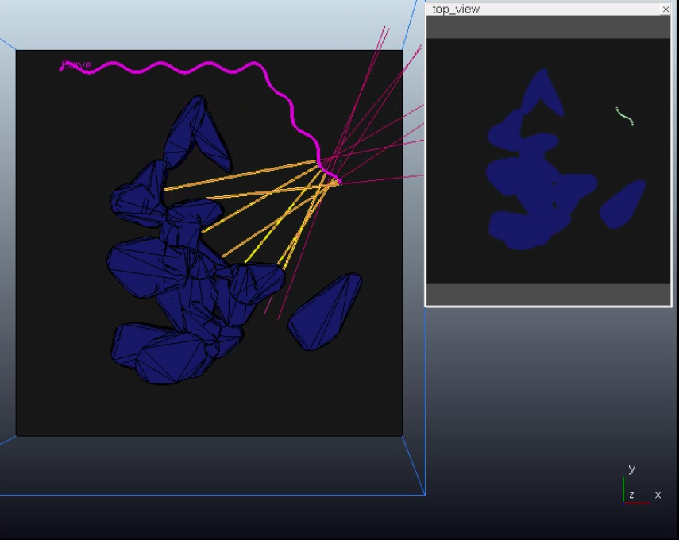
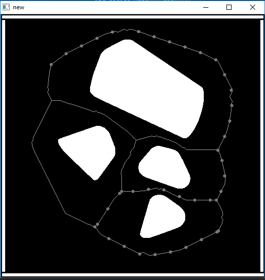

## Autonomous Snake Robot for Obstacle Avoidance

Nature has inspired many robot designs. Some of the best examples include [Cheetah](http://news.mit.edu/2015/cheetah-robot-lands-running-jump-0529), [WildCat](https://www.bostondynamics.com/wildcat) and [Modular Snake Robot](http://biorobotics.ri.cmu.edu/projects/modsnake/). Learning about the environment and reacting to it has been a major part of research on these robots. 

This project is an attempt to make a simple-to-build snake robot that can learn to avoid obstacles. I along with another undergrad worked on this project under the guidance of __Dr. Prithwijit Guha__ at Indian Institute of Technology Guwahati. You can read the detailed report <a href="#pdf">here</a>.															

## The problem statment

	The snake has several types of moving techniques including side-winding, serpentine and rectilinear motion. We focus our work on serpentine motion as it can use obstacles as suppport to move along. The serpentine motion is goverened by a controller that takes in several parameters as input. Given these parameters one can generate a variety of motion from the snake. But these parameters have to be manually tuned for a certain type of motion. Taking inspiration from a real snake, we try to move the snake through an obstacle filled map. This will require the snake to change it's motion depending upon the sensor data from the environment. We proppose that this sensor data along with the knowledge of the previous move can be used to predict the upcoming moves for the robot. 

## Approach used

	As there was no open source design available for our snake robot, we start our work with designing a simulated snake robot for training and testing our algorithms. We designed our robot using V-rep simulation software. We further tune the simulated robot by changing the design parameters. 
	We also need a global path planner to achieve autonomous navigation in an obstacle map. We use watershed algorithm to solve this problem. The approach is similar to vornoi diagrams that generates several possible paths through a given map. These are then used by the snake robot to generate data.

   

We propose the following approaches to design a predictive model for our robot. 

* Finding correlation between sensor data and control parameters of the serpenoid curve using k-means clustering.

* Using ARMA model to predict the control parameters by treating it as a time series.(signal processing based approach)

* Using a recurrent neural network to predict control parameters (machine learning based approach)
	
## Simulation 

	The snake and it's environment is designed on the Virtual Robot Experimentation Platform (V-rep). The design of the robot is based on the available material and components required to make a real robot. This will make it easier to reproduce the test results on a real snake robot. 
	

		<iframe width="441" height="278" src="https://www.youtube.com/embed/-zKmTJUTa3k" frameborder="0" allow="autoplay; encrypted-media" allowfullscreen>
		</iframe>
	

The snake robot uses serpenoid curve as its control scheme. This serpenoid curve is used to generate serpentine motion in the robot. The serpenoid curve was originally introduced by <a href ="https://dl.acm.org/citation.cfm?id=562623">Hirose</a> to approximate the the serpentine motion of a snake. We use the modified serpenoid curve.

 
 
 

## Path Planning  

	  
	We have used an image segmenting algorithm called watershed algorithm to segment the entire arena into sectors. The boundaries of these sectors have been taken as possible paths for the robot. Further details are mentioned in the report.

 
 
 
 
 

## LSTM Model

From our observaton made during the simualtion of the snake robot, we found that the the "c" value or the heading direction of the robot depends upon the previous configuration of the robot and the sensor data of the present time-stamp. Thus, we try to design a recurrent neural network using an LSTM cell to predict the "c" value from the sensor values and control paramters of previous time-stamp. We use a single layer of 50 neurons, each nueron being an LSTM cell. 

Input feature vector: 17 sensor values and "c" value from previous time-stamp 
Output of network: "c" value for current time-stamp.  
**Results:**  
_Trainig Loss: 0.0019_  
_Testing Loss: 0.0025_

The results suggest that an LSTM model can be used for this problem. 

## Demonstration

<b>Autonomous navigation using path planning</b> 

<iframe width="441" height="278" src="https://www.youtube.com/embed/W7V0BaGdjgE" frameborder="0" allow="autoplay; encrypted-media" allowfullscreen></iframe>

<iframe class="scribd_iframe_embed" title="asroa" src="https://www.scribd.com/embeds/385489123/content?start_page=1&view_mode=scroll&access_key=key-pd7T40nAx8ISK9CaSAvZ&show_recommendations=true" data-auto-height="false" data-aspect-ratio="0.7068965517241379" scrolling="no" id="doc_57066" width="100%" height="600" frameborder="0"></iframe>

