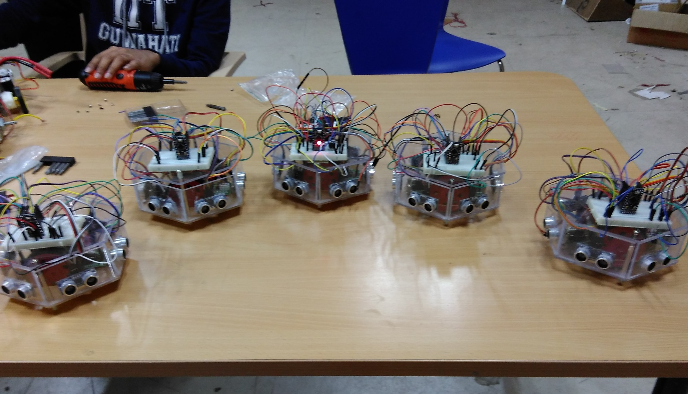
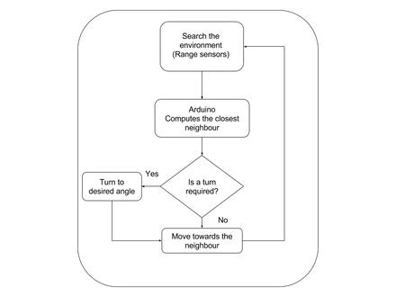
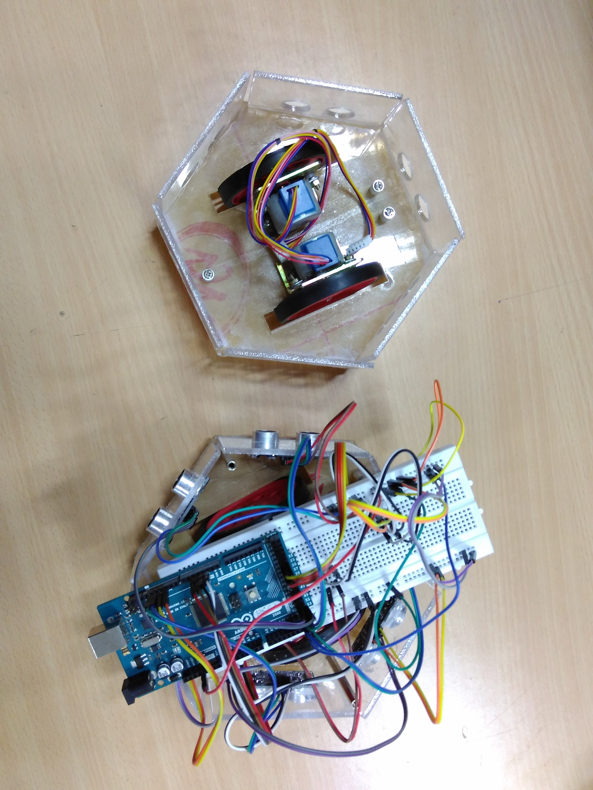

**Intelligent Swarm System**

I along with two undergraduate students worked on a swarm of robots under the guidance of Dr. Karuna Kalita at Indian Institute of Technology Guwahati. Hive (a name for collection of bees), is a group of autonomous robots designed to perform tasks in a collaborative and optimized manner. The robots are designed to search for objects in an indoor environment and assemble at a particular point. The focus of the project is on making a simple yet intelligent system of multiple robots that showcase Swarm Intelligence.

   

**Is it a Swarm system or a multi-robot system ?**

As per the definitions coined by Zhong-yang ZHENG in his paper on Swarm Intelligence, Hive can be considered a Swarm system. All the robots in Hive are independent and homogeneous in all senses. There is no Master-Slave correspondence. The software design is robust to the number of robots in the group thus making the system easily extensible.

## Algorithms

**Collaborative Search**

A modified form of Particle Swarm Optimisation algorithm is implemented to perform an optimised search of the environment.The robots search their neighbouring environment for a particular type of stimuli and store information for Mapping. 

**Rendezvous Algorithm**
  

A custom designed rendezvous algorithm is used for successful aggregation of robots. The range sensors search for other objects in a local area around the robot. The robot then moves towards the closest object found. The decision is updated continuously which helps the robot in differentiating between a fellow bot and a passive object.

## Design

The body of the robot was designed on SolidWorks CAD software and cut out of _4mm_ Plexi-glass sheet.

**Electronics**
 

The robot is powered by _ATmega328u Micro-controller_.  
Each of them is made of
* 2x Stepper DC motors
* 6x Ultrasonic range sensors
* 2x Motor driver modules

 
 
 
 

## Demonstration

<b>Testing the range sensors</b> 

<iframe width="600" height="350" src="https://www.youtube.com/embed/bafYjByexFc" frameborder="0" allow="autoplay; encrypted-media" allowfullscreen align="center"></iframe>
 
 

<b>Rendezvous demonstration</b> 

<iframe width="620px" height="325px" src="https://www.youtube.com/embed/POwtcVPyVss?rel=0&controls=1&utoplay=1&loop=1&rel=0&showinfo=0" frameborder="0" allowfullscreen></iframe>

